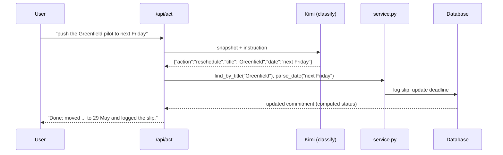
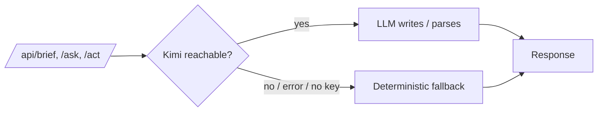

# Architecture

This document explains *why* Loop AI is built the way it is. The headline:

> **Code owns the facts. The LLM owns the language.**

Most "AI app" demos let the model do everything (read the data, decide what matters, and phrase the answer), which is exactly how you get confident, wrong answers. Loop AI draws a hard line between the two responsibilities.

---

## 1. Two responsibilities, kept separate

| Concern | Owner | Where |
| --- | --- | --- |
| What is the status? Effective deadline? Slip count? Should this escalate? | **Deterministic code** | `app/status.py` |
| How do we *say* it? What did the user *mean*? | **The LLM** | `app/ai.py` |
| Doing the thing (mutating data) | **The service layer** | `app/service.py` |

The model is never on the critical path for a fact. It writes prose and it parses intent into a structured request: both things it is reliably good at. It never decides whether something is "at risk," because that is a rule, and rules belong in code where they can be unit-tested.

---

## 2. The status engine (`status.py`)

The engine is a handful of **pure functions** over a commitment and an `as_of` date. No I/O, no globals, no model calls, which means it is trivially testable and identical every time.

```
status(c, as_of) =
    complete   if every milestone is done (on/before as_of)
    missed     if as_of is past the effective deadline
    at_risk    if (deadline within APPROACH_DAYS and no update in > STALE_DAYS)
               or (slip_count >= 2)
    on_track   otherwise
```

with two tunable constants (`APPROACH_DAYS = 3`, `STALE_DAYS = 4`) and an **effective deadline** that follows the latest slip logged on or before `as_of`.

Because every function takes `as_of`, the entire board can be evaluated *as of any date*, which is what powers time-travel (§5) and the escalation simulation (§4).

`tests/test_status.py` pins all of this down with transient ORM objects and **no database**: the engine is pure, so the tests are too.

---

## 3. The agent's structured-action pattern

This is the part that makes it an *agent* rather than a dashboard. A natural-language instruction becomes a typed, executed mutation, without ever trusting the model to touch the database.



Key points:

- The model returns **only** a small JSON object (`reschedule` / `add_milestone` / `create` / `answer`). It does not write SQL, dates, or statuses.
- `service.py` owns the dangerous parts: fuzzy title matching, natural-language **date parsing** (`"next Friday"`, `"in 5 days"`, `"end of month"`…), and the actual write.
- If parsing fails or the model is unreachable, the endpoint falls back to answering the question; it never guesses an action.

The same `/api/act` endpoint powers the whole "Ask the agent" panel: ask a question and it answers; give a command and it executes.

---

## 4. The escalation ladder (`agent_events`)

The agent-activity rail isn't a log of random model output; it's a **deterministic replay**. `agent_events(c, as_of)` walks day-by-day from a commitment's start to `as_of` and derives what the agent *would have done*:

```
deadline approaching + owner gone quiet   ->  nudge the owner
nudge ignored for 2+ days                 ->  escalate to the Founder's Associate
deadline missed                           ->  escalate to the founders
2nd slip                                  ->  flag a pattern
```

Because it's computed, it's stable and explainable: the same data always yields the same ladder, and you can point at the exact rule that fired. The UI then attaches copy-ready Slack/email drafts to each event.

---

## 5. Time-travel (`as_of`)

Every read endpoint accepts `?as_of=YYYY-MM-DD`. The server recomputes the whole board as of that date (statuses shift, deadlines move, new escalations appear) **without mutating anything**. This is the "skip a week" feature, and it's essentially free because the engine already takes `as_of` everywhere. Mutations always happen at real "now"; `as_of` is purely a read-time lens.

---

## 6. Graceful degradation

The AI is an enhancement, not a dependency.



`/health` probes reachability (cached 60s) so the UI can show a live/local badge. Every AI endpoint wraps its model call in a `try/except` that falls back to a deterministic equivalent: a templated brief, a rule-based risk list, an "answer" instead of an action. **The product is fully usable with no API key**, which also makes the test suite hermetic.

---

## 7. Data model

```
Commitment 1───* Milestone   (title, due, done, done_on)
           1───* Update      (text, date)
           1───* Slip        (from_date, to_date, reason, date)
```

Stored values are deliberately minimal: only raw facts (dates, text, flags). Everything derived (status, effective deadline, slip count, next milestone, the event ladder) is **computed on read** and never persisted, so it can never drift out of sync with the source data. Responses (`schemas.py`) carry these computed fields; the database does not.

SQLAlchemy 2.0 (`Mapped` / `mapped_column`) with SQLite by default and Postgres via `DATABASE_URL`.

---

## 8. Frontend: a thin, typed view layer

The Phase-1 prototype was a single HTML file that duplicated the status engine in JavaScript and stored state in `localStorage`. The rewrite inverts that: **all logic lives in the typed backend, and React is a pure view layer.**

- **`api/types.ts`** mirrors the Pydantic schemas; **`api/client.ts`** is a tiny typed fetch wrapper. Nothing in the frontend computes a status or a deadline; it renders what the server computed.
- **`store/store.tsx`** is a small React context that holds `{commitments, activity, health}` and the time-travel offset. Every mutation follows one rule: **call the API, then refetch.** The UI is therefore always a reflection of backend truth, never an optimistic guess that can diverge.
- No Redux/MobX: the app's state is small and the mutate-then-refetch pattern keeps it honest. Filtering and sorting are the only client-side logic, and they operate purely on server-computed fields.

The design system (calm, Linear/Attio-flavoured) is plain CSS with custom properties; no UI framework, so the look is fully owned.

---

## 9. Testing strategy

- **Engine tests** (`test_status.py`): pure functions, transient objects, no DB. Fast and exhaustive on the rules that matter.
- **API tests** (`test_api.py`): spin up the app against a throwaway SQLite DB and exercise the real endpoints, including the deterministic fallbacks (so they pass with **no API key**).
- **Frontend**: `tsc` typechecks the whole app and `vite build` proves it bundles; both run in CI.

---

## 10. Trade-offs and what I'd revisit

- **`create_all` instead of migrations.** Fine for a demo; Alembic is the real answer (noted in the roadmap).
- **Compute-on-read.** Cheap at this scale and always correct; at large N you'd cache or precompute the heavier aggregates.
- **Polling, not push.** Mutate-then-refetch is simple and correct; websockets would make the board feel live.
- **Brief regeneration is manual.** It doesn't auto-rewrite on every tiny edit, which would be slow and spammy against the LLM; a weekly artifact regenerates on demand or on date change.

The throughline: keep the irreversible, high-stakes decisions in deterministic, tested code, and let the model do the part that's genuinely linguistic. That boundary is the whole design.
